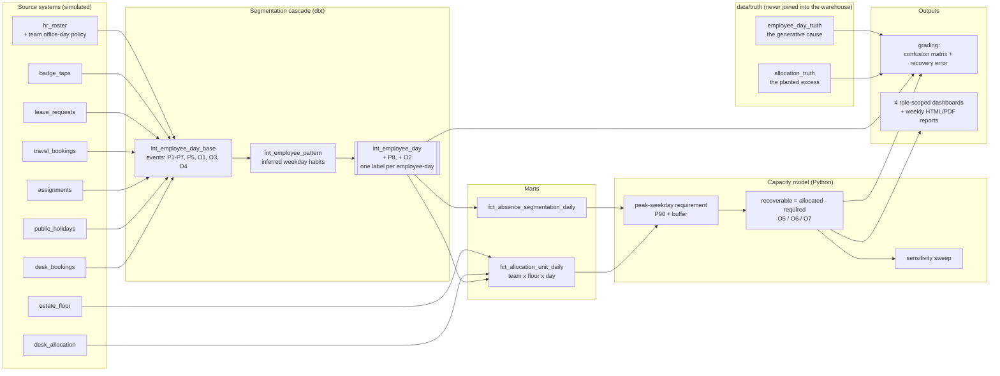
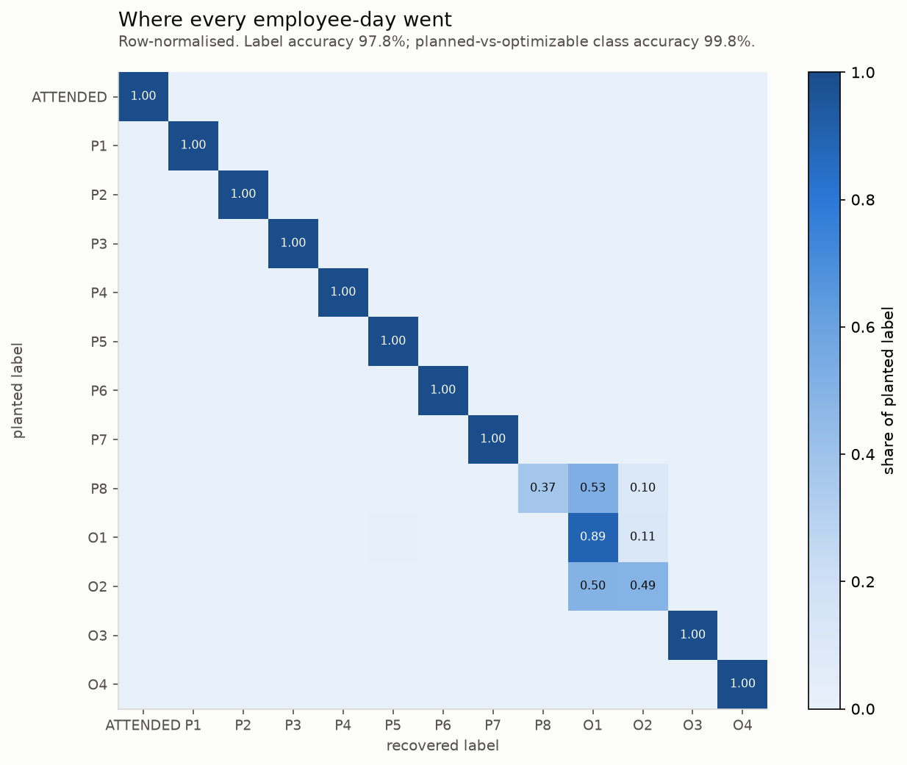
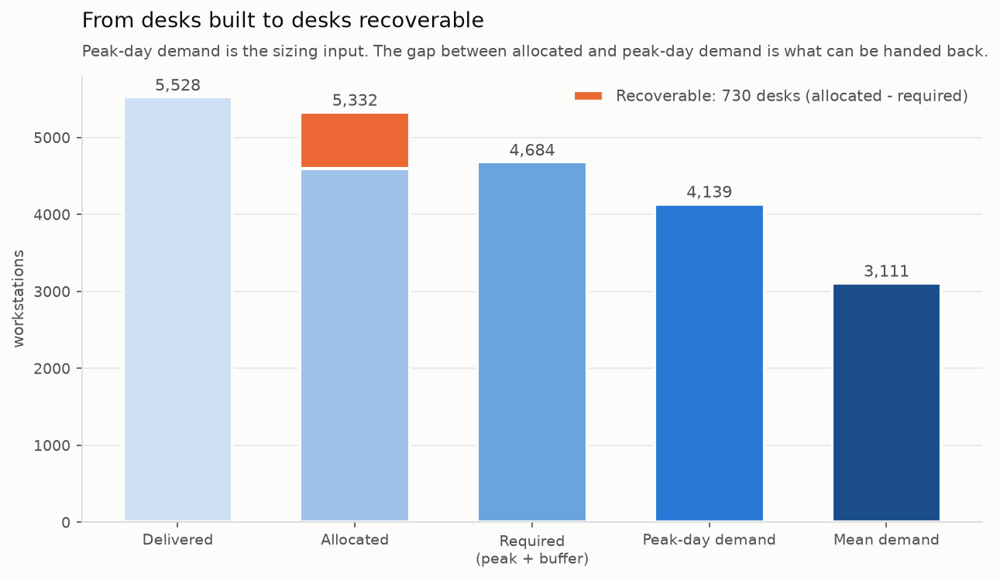
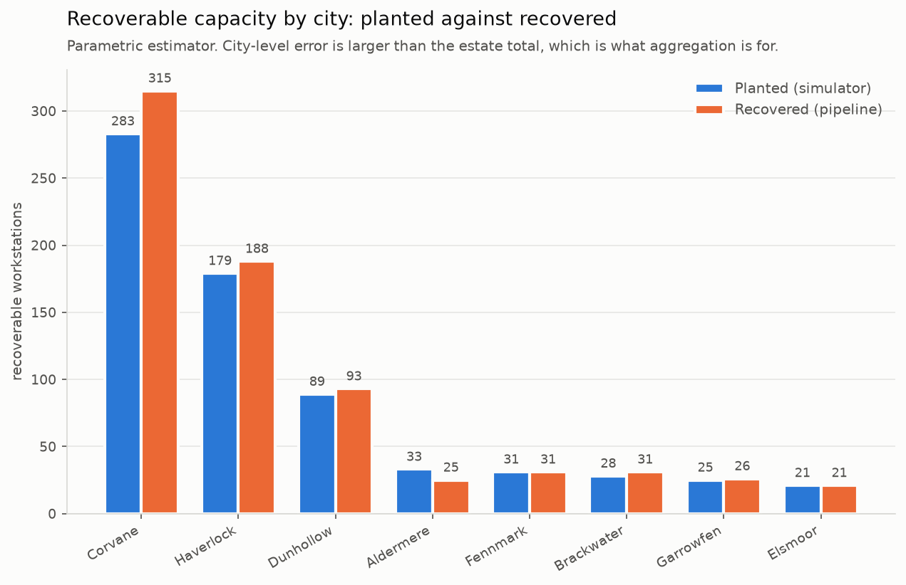
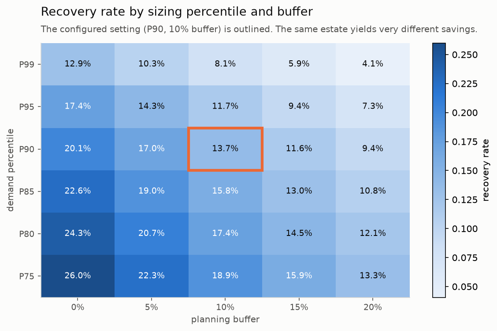
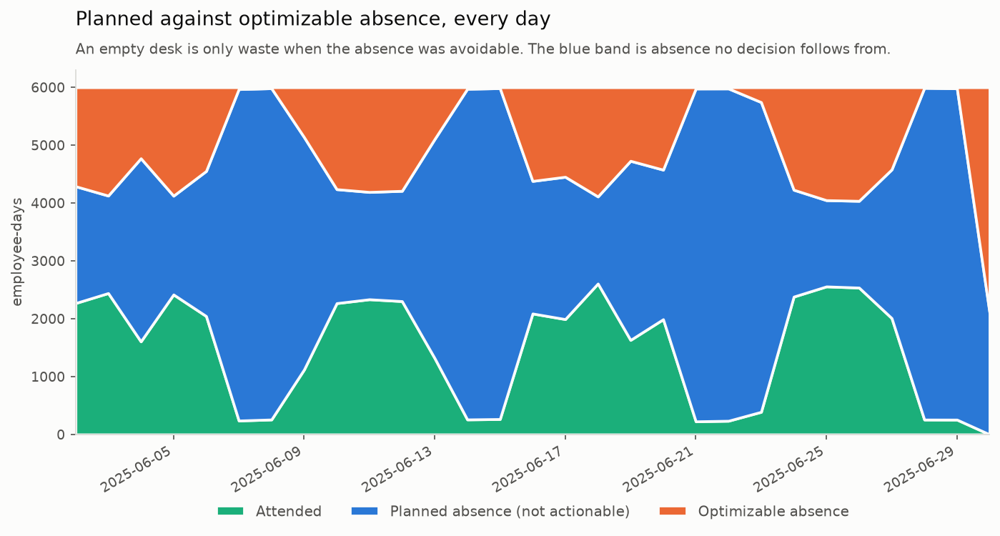
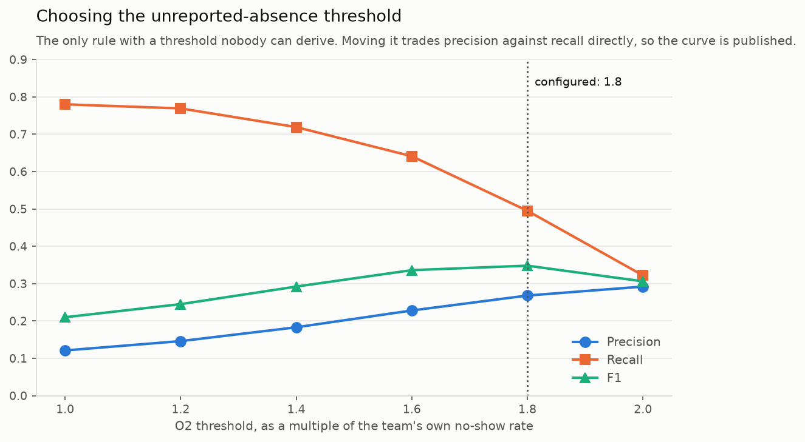

# absence-segmentation-engine

Separates workplace absence into *planned* and *optimizable*, converts the optimizable part into
recoverable desks and money, and is graded against a known answer at every step.

> **Synthetic data notice.** All data in this repository is programmatically generated. It
> contains no proprietary, confidential, or personal data, and no real operational figures.
> This is a reimplementation of analytical methodology on simulated data, built to demonstrate
> technique. Results shown are properties of the simulator, not of any organisation.

---

## Problem

An empty desk is not automatically waste.

If the person it belongs to is on approved leave, travelling, posted to another city, or simply
not expected in that day, the desk being empty is the system working as designed, and no decision
follows from it. Waste only means something when the absence was avoidable or the allocation was
wrong — and those are the only two cases where removing a desk is safe.

Most occupancy reporting cannot tell the difference. It measures desks against headcount, finds
that half of them are empty, and produces a number that is simultaneously true and useless: act on
it and you take desks away from teams that need them on Wednesdays.

This repo builds the taxonomy that separates the two, measures each bucket, and converts the
optimizable portion into a defensible capacity and cost figure — with the sensitivity analysis
that shows how much of the answer is a choice rather than a measurement.

---

## Architecture



Orchestrated by Dagster: seven assets, three checks (two blocking), a daily refresh schedule, a
weekly reporting schedule, and a freshness sensor with an alert stub.

---

## Method

### 1. The taxonomy has two grains

The brief this is built from lists fifteen categories in one numbered list. Seven of them are not
properties of an employee-day: nothing about a single Tuesday is "structurally oversupplied" — a
*team's allocation* is, across weeks. Forcing them into one grain means either inventing an
arbitrary attribution or giving up the "exactly one label" guarantee.

So there are two cascades:

| Cascade | Grain | Labels |
|---|---|---|
| Employee-day | `(emp_id, local_date)` | P1–P8, O1–O4, ATTENDED |
| Allocation excess | `(team, workplace, floor)` | O5, O6, O7 |

They meet in `fct_allocation_unit_daily`, which is the bridge from *why was this person absent* to
*how many desks can we hand back*. (ADR 1)

### 2. Precedence, and three places it departs from the brief

Every employee-day gets **exactly one** label, first match wins, and the rule that fired is stored
on the row as `label_reason`.

| # | Label | |
|---|---|---|
| 1 | **P7** post exit | *moved up* — nothing else can be true of someone who had left |
| 2 | **P6** not yet onboarded | *moved up* — same reasoning |
| 3 | **P2** public holiday | *above P1* — a day the office is shut is not leave anybody spent |
| 4 | **P1** approved leave | |
| 5 | **P3** business travel | |
| 6 | **P4** on assignment in another city | |
| 7 | **O3** partial day / **ATTENDED** | *above P5* — see below |
| 8 | **P8** shift pattern offset | inferred |
| 9 | **P5** not a scheduled office day | |
| 10 | **O4** desk booked, never used | *above O1* — strictly more specific evidence |
| 11 | **O2** unreported absence | pattern rule |
| 12 | **O1** no-show on a scheduled day | |

**Attendance before the schedule rules.** Someone who came in on a day they weren't expected has
attended. Filing that as "not a scheduled office day" hides real desk demand inside a planned
bucket, and the capacity model then sizes the floor too small.

**O4 before O1.** A booked desk never used is a no-show with a receipt. Under the brief's literal
ordering O1 fires first and O4 is unreachable — the bucket exists and never contains anything.
(ADR 2)

### 3. Two labels have to be inferred

Ten labels have a source record behind them. Two do not, and both were got wrong first time.

**P8 (shift pattern offset).** The roster publishes the *team's* policy, not an individual's
variation from it. The first implementation fired on absences *outside* the team's office days —
exactly backwards, since a shift worker's planned absence is *on* a team office day that isn't one
of their own. Fixing it needed two separate inferences: that the person works different days from
their team at all, and that *this weekday* isn't one they work. With only the first, the rule
excuses every absence that person ever has.

**O2 (unreported absence).** "Three misses in ten scheduled days" is only meaningful at a
particular attendance rate. At 60% the average person misses four of ten by chance, so the
absolute rule labelled most of a team as an unreported absence. It now also requires the window
rate to exceed the *team's own baseline* by a multiple — so the bucket means what it says: an
outlier among peers.

Both rules are deliberately tuned to **under-fire**. A false P8 or O2 moves waste out of the
optimizable bucket and flatters the estate, which is worse than missing some of it. (ADR 4)

### 4. Sizing: the percentile, the peak weekday, and the two estimators

$$\text{required}_u = \left\lceil \text{Q}_{p}\big(\text{demand}_u \mid \text{peak weekday}\big)\times(1+b) \right\rceil, \qquad \text{recoverable}_u = \max(\text{allocated}_u - \text{required}_u,\ 0)$$

Three things in that formula are doing real work.

**The percentile, not the mean.** An estate sized to mean demand is short of desks on roughly half
of all working days. Sizing to P90 costs capacity and buys a building people can sit in.

**The peak weekday, not all weekdays pooled.** A three-day team has near-zero demand on Monday and
Friday. Pooling those into one distribution drags the percentile down and sizes a floor that works
on average and fails every Wednesday. Pooled sizing over-recovered by **75%**.

**The floor is per unit.** An over-sized team must not be able to cancel out an under-sized one.
28 units on the demo profile are under-sized — they need desks *added*, and they contribute zero
to recovery rather than a negative.

Two estimators are implemented and both reported:

- **parametric** — daily demand as a Poisson-binomial, normal approximation, $\mu + z_p\sigma$.
  Stable at short horizons; shares its formula with the generator, so what it tests is the
  measurement chain from taps to desk-days rather than the statistics.
- **empirical** — the observed quantile directly. Shares nothing with the generator, and is the
  honest control.

### 5. What is *not* added

The brief asks for a policy fraction of O1 and O4 to be added to recoverable capacity. It should
not be, and this is the one place the implementation departs from the specification on purpose.

A no-show consumes no desk. Their absence is therefore *already inside* the demand distribution the
percentile is taken over — it has already pushed the percentile down, and the desk they didn't use
has already been counted as recoverable, once. Adding a fraction again double counts, in the
flattering direction.

O1 and O4 are still computed and reported, as a **behavioural opportunity** with the policy
fractions visible, and kept out of the capacity number. Converting a chronic no-show to the sharing
pool changes *who holds* a desk, not how many exist, and it pays off only if behaviour changes —
a management action with an uncertain return, which shouldn't be mixed into a lease decision with a
certain one. A test asserts the two never merge. (ADR 3)

---

## Results on synthetic data

Seed `61803`, 28-day demo profile, 6,000 employees over 14 workplaces. Every figure is a property
of the simulator.

### Did the cascade put each day in the right bucket?

| | |
|---|---|
| **Label accuracy** (13 labels) | **97.78%** |
| **Planned vs optimizable class accuracy** | **99.78%** |
| Exact recovery (recall ≥ 0.99) | P1, P2, P3, P4, P6, P7, O3, O4, ATTENDED |

Class accuracy is the number that drives the decision: a day misfiled from O1 to O2 changes who
gets a conversation, while a day misfiled from O1 to P1 changes whether a desk gets removed.



The only off-diagonal mass is the two inferred labels, and both limits are structural:

| Label | Recall | Precision | Why |
|---|---|---|---|
| P8 | 0.37 | 0.67 | 0.45 on three-day teams, **0.04 on four-day teams** — a shifted four-day pattern overlaps the original on three of its four days, and a five-day pattern is identical. No evidence in badge data separates those cases. |
| O2 | 0.49 | 0.27 | A lagging classifier; 28 days is near its floor. |
| O1 | 0.89 | 0.95 | Loses to O2 over-firing, which is the same trade. |

### Did the capacity model recover the right number of desks?

| Estimator | Planted | Recovered | Error | Planted saving | Recovered saving |
|---|---|---|---|---|---|
| **parametric** | 689 | **730** | **+5.9%** | 461,725 | 486,573 |
| empirical | 689 | 941 | +36.6% | 461,725 | 622,982 |

**Recovery rate 13.69%** (95% CI 11.90%–15.46%, bootstrapped over allocation units — resampled over
units rather than days, because every day was observed and the uncertainty is that a different draw
of *units* would give a different total).

The 30-point gap between the estimators is the real finding. A 90th percentile estimated from four
Wednesdays is close to the maximum of four draws and is biased low, so the empirical estimator
under-states the requirement and over-states what can be handed back. That gap *is* the measure of
how much history a resizing decision needs.





City-level error is larger than the estate total, which is what aggregation is for — and is why a
per-city figure should carry its own interval before anyone acts on it.

### How much of the answer is a choice?



The same estate yields a **4.1%** recovery rate at P99 with a 20% buffer and **26.0%** at P75 with
no buffer — a six-fold range, on identical data. Anyone presenting a single savings number without
this behind it is presenting an opinion with a decimal point on it.

### The taxonomy at work





The O2 threshold is set at 1.8 because that maximises F1 on this curve, not because it seemed
reasonable. At 1.0 the rule finds 78% of the chronic cohort at 12% precision; at 2.0 it is 29%
precise and finds a third of them.

---

## How to run

```bash
make setup      # uv venv + install (Python 3.11+, offline, no credentials)
make demo       # generate → load → dbt → charts → reports → results table
make dashboard  # Streamlit, with the role selector
make test       # 48 tests, including one end-to-end
```

`ASE_PROFILE=full make pipeline` runs the same graph at 95,000 employees over 180 days.

---

## Design decisions and trade-offs

- **Two cascades at two grains, not one list of fifteen labels.** Forcing O5–O7 to employee-day
  grain needs an arbitrary attribution rule and produces a number nobody can act on. Cost: the
  bridge between the grains is an extra mart. (ADR 1)

- **The behavioural lever is reported, not added.** The brief's additive formula double counts,
  because a no-show's desk is already inside the demand distribution. The headline saving here is
  smaller than the specification would produce — deliberately. (ADR 3)

- **The plant is sized from realised demand, not from attendance propensities.** The first version
  computed the true requirement analytically from each member's propensity, which assumes nobody is
  ever on leave. It sat permanently above anything badge evidence could support and accounted for
  40% over-recovery on its own. Consequence: the parametric estimator now shares a formula with the
  generator, so the empirical estimator is reported as the independent control.

- **Both inferred rules under-fire rather than over-fire.** A false P8 or O2 moves waste into the
  planned bucket and flatters the estate. Cost: genuine cases are missed until enough history
  accumulates, which is visible in the P8 and O2 recall figures rather than hidden. (ADR 4)

- **Thresholds live in config and are checked across files.** `conf/sim.yaml` and
  `dbt_project.yml` both carry the taxonomy thresholds, and a test — plus a pre-commit hook —
  fails if they disagree. A rule meaning 2.5 hours in one file and 3.0 in another produces two
  defensible taxonomies and no way to choose.

- **Role scoping is enforced in the query layer, and columns are dropped rather than hidden.** A UI
  that filters rows it has already fetched is a layout choice that looks like access control until
  someone exports the frame. A missing scope column is *refused*, not ignored — silently returning
  everything is the worst possible failure mode for an access rule.

- **Exactly one Dagster asset is partitioned.** Generation, loading and dbt operate on the whole
  window and partitioning them would be decoration. The daily segmentation extract is genuinely
  per-day, so it gets partitions, an atomic write, and an idempotency test — without which a
  backfill is a gamble.

- **PDFs come from matplotlib, not an HTML-to-PDF engine.** WeasyPrint or a headless browser would
  look better, at the cost of a heavyweight dependency or a binary this repo can't assume exists.
  Everything that matters is in both formats.

---

## What I would do differently at production scale

- **The 28-day window is too short for the pattern rules, and the repo says so rather than hiding
  it.** O2 and P8 are lagging classifiers. On the 180-day profile both should improve materially,
  but the honest general point is that a rule which needs history cannot be deployed against a new
  estate and expected to work in month one.

- **P8 is unidentifiable for four- and five-day teams, and no amount of tuning fixes that.** The
  real answer is to stop inferring it: shift patterns are a fact somebody knows, and the fix is a
  source system that records them, not a cleverer classifier.

- **The demand percentile treats all units alike.** A 200-person floor and a 6-person team should
  not be sized at the same percentile — the small unit's demand is far noisier, and P90 on six
  people is nearly its maximum. A production version would size by a prediction interval that
  widens with unit size, or pool small units into a shared pool rather than sizing them at all.

- **Desk demand is inferred from badge taps, which measure the building, not the desk.** Someone
  who badges in and spends the day in meeting rooms consumes a desk in this model and a room in
  reality. Sensor or booking data at desk level would change the partial-day rule most of all,
  which is currently an upper bound on dwell time rather than a measurement of it.

- **Savings are modelled as desks times cost, which is not how leases work.** Real recovery is
  lumpy and discontinuous: you hand back a floor, or a lease break, or nothing. A production model
  reports recoverable capacity against the *lease events* that could realise it, and most of the
  theoretical saving in any given month is not actually available.

- **No causal claim is made or should be.** This measures what capacity is unused. It does not
  establish that removing it is free — teams grow, patterns shift, and a floor handed back is
  expensive to get back. The sensitivity sweep is the closest thing here to a risk model, and it is
  not one.

- **Everything runs single-node.** DuckDB handles 17M employee-days on the full profile fine, but
  every model is a full rebuild, there is no concurrency story, and the capacity model is pandas in
  a single process. The dbt models are plain SQL so the graph would lift to Snowflake or BigQuery;
  the incremental strategy would need writing from scratch.

---

## Repo map

```
conf/sim.yaml               every number in the repo traces here
src/absence_engine/
  config.py                 typed, validated config; scale profiles
  contracts.py              Pandera schemas at every module boundary
  gen/                      ten source systems + the truth set
    estate.py org.py        cities, floors, teams, seating
    allocation.py           the planted excess: where recovery comes from
    absence.py              holidays, leave, travel, assignments
    attendance.py           the day loop, and the generative cause per day
  warehouse/loader.py       validate in pandas, load through DuckDB
  capacity/
    model.py                requirement, recoverable, savings, sensitivity
    grading.py              confusion matrix, recovery error, O2 calibration
  reporting/
    scope.py                role definitions; scoping enforced here
    reports.py              weekly per-role HTML + PDF
    charts.py results.py    README charts and the make demo table
  orchestration/            Dagster assets, partitions, checks, sensor
dbt/
  models/staging/           typed, localised, business-dated
  models/intermediate/      the two-pass cascade
  models/marts/             segmentation and allocation-unit facts
app/streamlit_app.py        four role dashboards, one app
docs/decisions/             4 ADRs
docs/img/                   charts, generated by a script
tests/                      48 tests, incl. one end-to-end
```

MIT licensed.
